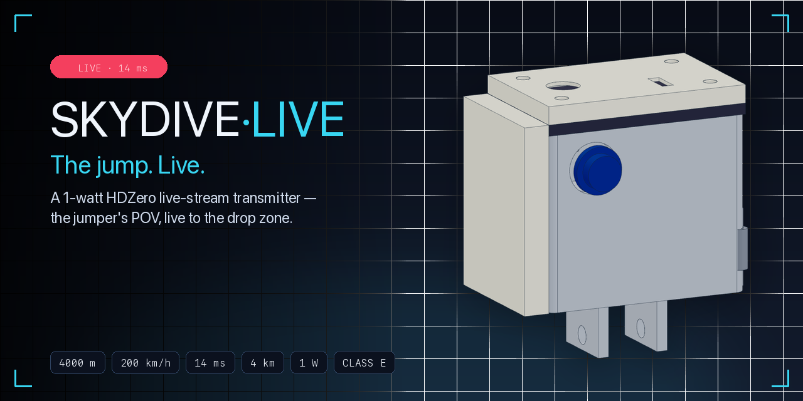
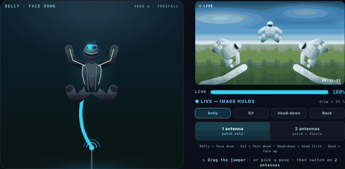
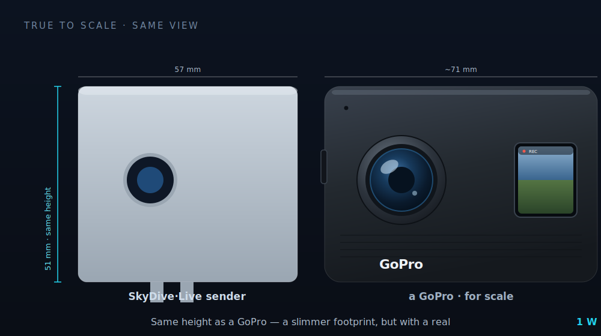
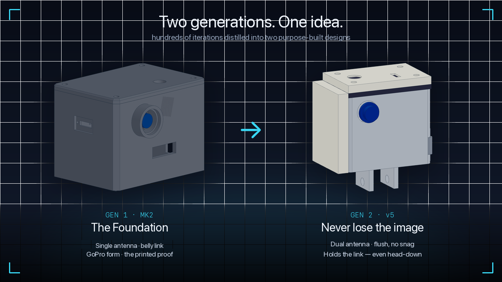
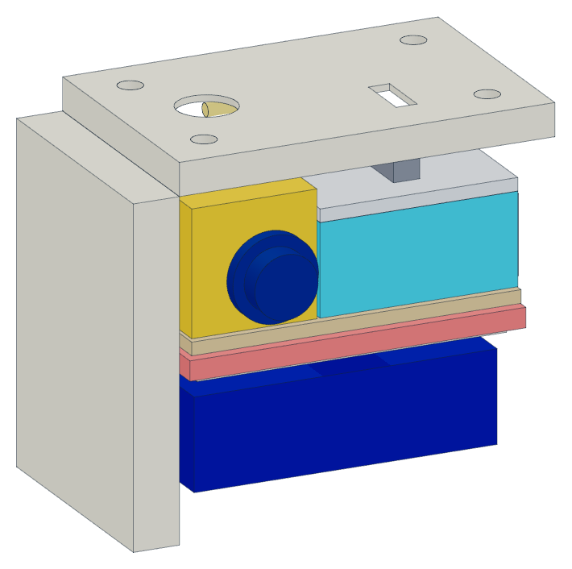
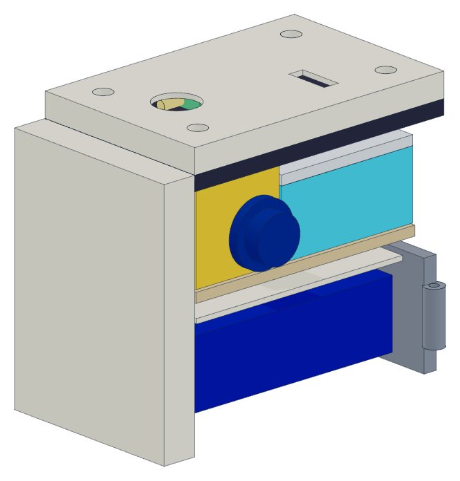
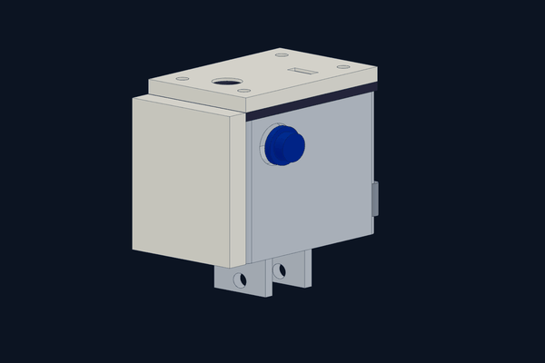
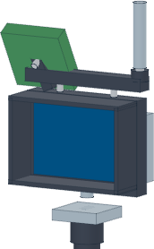

<div align="center">



### Real-time video from freefall — the jumper's POV, live on the screen at the drop zone.

[](#status--roadmap)
[](LICENSE)
[](#reproduce-the-cad)
[](https://schoentom.github.io/skydive-live/)
[](https://schoentom.github.io/skydive-live/decks/)

**[▶ Spin it in 3D](https://schoentom.github.io/skydive-live/#model)** · **[Pitch decks](https://schoentom.github.io/skydive-live/decks/)** · **[The numbers](ENGINEERING.md)** · **[Build it](BUILD.md)**

<a href="https://schoentom.github.io/skydive-live/#play"></a>

*The moment that kills every single-antenna link — played by the [live demo](https://schoentom.github.io/skydive-live/): head-down → **NO SIGNAL** → the dipole takes over. **▶ Drag the jumper yourself.***

</div>

---

## What if the whole drop zone could watch — live?

<div align="center">

</div>

Today, the ground sees only **a dot in the sky**. Spectators, the waiting area, your own team — they follow the jump with the naked eye, and the footage only arrives *after* landing. The moment itself stays invisible.

**SkyDive·Live** puts the jump on the screen **as it happens**. A helmet-mounted transmitter the size of an action cam sends a digital HDZero picture from ~4 km up to a receiver at the landing zone — straight onto the big TV in the waiting area. Its own radio link, no internet, ~14 ms latency. Not a recording. **The present tense.**

```
Camera (MIPI) → 1 W VTX → U.FL → antenna(s) → ~4 km of air → ground antenna array → diversity RX → HDMI → monitor / public-viewing TV
```

---

## What it is, in one picture

<div align="center">

</div>

### The signal's journey — helmet to the waiting-room TV

<div align="center">

</div>

---

## Two generations. One idea.

Eleven housing generations and hundreds of scripted CAD checks, distilled into **two purpose-built designs** — a proven foundation, and a leap that attacks the one moment that breaks every single-antenna link.

<div align="center">

</div>

### ① Gen 1 — MK2 · *The Foundation*

The complete printed system, and the proof the concept holds together — GoPro form factor, tool-free battery swap, real off-the-shelf RF parts.

### ② Gen 2 — v5 · *Never lose the image*

**A body is a shadow.** Belly-down (face down), the antenna points cleanly at the ground. Go **head-down** (falling head-first) and the jumper's own body slides between transmitter and ground — a single antenna tears off, right at the most spectacular moment. So Gen 2 carries **two**: a patch flush in the side end-cap and a dipole up top, and an RF switch that picks the better one in real time. Both sit **flush** in the shell — screwed in, no stuck-on bump, no snag risk.

> 🛰️ **Feel it yourself** — the interactive [dual-antenna demo](https://schoentom.github.io/skydive-live/) (the GIF at the top is this demo, playing itself): rotate the jumper head-down, watch the single antenna drop to *"NO SIGNAL"*, then switch on the second and watch the link hold.

---

## Inside the sender

<div align="center">

</div>

Every block has its place — justified thermally and by RF. **Colour = component identity**, the same key used throughout the pitch deck:

| | part | what it does | real off-the-shelf part |
|---|---|---|---|
| 🟠 **Camera** | the eye | HD wide-angle skydive POV; lens flush through the front wall — nothing protrudes to snag | HDZero Micro V3 |
| 🟦 **VTX** | the radio heart | turns the picture into a 1 W signal, ~14 ms, reaches 4 km with margin | HDZero Freestyle V2 |
| 🟩 **Antenna** | the link | patch in the flush side end-cap covers the ground link; RHCP; Gen 2 adds the up-facing dipole | TBS 5G8 RHCP patch |
| 🟦 **Battery** | the energy | 3S LiPo in a protected, tool-free swap tray; externally charged | 3S LiPo + BMS |

---

## The numbers that matter → [`ENGINEERING.md`](ENGINEERING.md)

This is not a hobby gamble. Every critical path is calculated, and **honestly split into *calculated* vs *to-be-measured*.**

<div align="center">

</div>

| | value | |
|---|---|---|
| 📡 **Transmit power** | +30 dBm (1 W) — PMSE short-term assignment for the event, 25 mW SRD for all tests | planned path |
| 📡 **Free-space loss @ 4 km** | 119.8 dB (5.8 GHz, Friis) | ✅ derived |
| 📡 **Link margin @ 4 km** | **≈ +8 dB** belly (favourable heading) · **≈ +2 dB** worst heading via the dipole · head-down rides the threshold | calculated, v5 geometry |
| 📡 **The honest twist** | the side-mounted patch makes belly margin *heading-dependent* — re-run 2026-06, assumptions & sensitivity in [ENGINEERING.md](ENGINEERING.md) | self-corrected |
| 🌡 **Thermals in freefall** | ΔT **≈ 6 K** — ram-air convection carries the VTX heat | calculated |
| 🔋 **Runtime** | ~40 min theoretical / ~32 min practical | dimensioned |
| ⚖️ **Sender mass** | ~200–250 g | dimensioned |

> **The hard case (head-down — falling head-first)** is identified and attacked at the source: dual antenna at the sender **plus** diversity at the ground — the architecture of the only proven precedent (Corliss/Vislink 2016). The recalculated margins are thinner than the first pass and say *fluctuating link, not dead link*; the turntable pattern measurement of the assembled sender decides it. **No overclaiming** — when our own numbers got worse, we published the worse numbers.

---

<div align="center">

</div>

## Build it yourself → [`BUILD.md`](BUILD.md)

<div align="center">


</div>

**Two builds, one idea — pick yours:** **Gen 1 · MK2** (simplest & most robust — 3 PETG parts, the proven first build) or **Gen 2 · v5** (dual-antenna, flush — 7 ASA parts, holds the link in any orientation). Each gets its **own chronological step-by-step plan** — print → prep → assemble (in order) → wire & power → fit tests — in **[`BUILD.md`](BUILD.md)**.

---

## The printed parts & how the housing assembles — Gen 2 · v5

*(This is the 7-part Gen 2 build. Prefer the simpler **Gen 1 · MK2** — 3 PETG parts? Its own plan is in [`BUILD.md`](BUILD.md).)*

<div align="center">

</div>

Seven printed parts (ASA), each **watertight and collision-checked**. **STEP files for SolidWorks** (both builds) + STL + 3MF live in [`cad/`](cad/); printable STLs are also on the **[v1.0 release](../../releases/tag/v1.0)**.

| part | role | print note |
|---|---|---|
| **Body** | main shell · integral heat-wall · side battery door · flat GoPro mount (M5×0.8) | open-top-up · tree-support under the 2 GoPro fingers |
| **Cover** | top lid · GORE pressure-vent · 4× M3 into heat-sets | flat, no supports |
| **Electronics sled** | carries the VTX + camera, drops in above the heat-wall | no supports |
| **Antenna module** | screws onto the top (4× M3) — holds the λ/2 dipole + RF switch (Gen 2) | minimal |
| **Antenna end-cap** (−X side) | flush RF window — holds the patch (the aluminium body is its ground-plane) | minimal |
| **Battery tray** | 3S LiPo · slide-in, push-detent + lanyard (won't open in freefall) | no supports |
| **Battery door** | side, tool-free — swap a battery between jumps | minimal (hinge) |

**Assembly:** ① heat-sets into the body → ② patch into the −X side end-cap → ③ load the tray, slide it in → ④ VTX + camera on the sled, drop in and wire through the heat-wall → ⑤ dipole + RF switch into the module → ⑥ cover on (4× M3) → ⑦ close the door.

**Print:** ASA (never PLA — it softens too low) · **+0.8 % isotropic shrink** · 0.2 mm layers · perimeters that fully fill the 3.0 mm wall · enclosure + heated bed. Fasteners: **M2/M3 brass heat-sets** (no self-tappers) + an M5×0.8 GoPro thumbscrew. Full step-by-step in [`BUILD.md`](BUILD.md).

---

## The other half — the ground station

<div align="center">

</div>

A monitor on a tripod catches the signal over **two antennas** (omni + directional patch) and always shows the stronger one — true **diversity**, the same approach professional systems use. Daylight-readable with a sun-hood; an external recorder grabs an instant-playback copy; HDMI runs the same picture onto the big public-viewing TV. **Two safeguards against the same dropout — the picture gets through.**

<div align="center">

</div>

---

## Reproduce the CAD

Everything is parametric and scriptable:

- 🧊 **Interactive 3D** — [spin the model in your browser](https://schoentom.github.io/skydive-live/) (assembled ↔ exploded). GLBs ship with the **[v1.0 release](../../releases/tag/v1.0)**.
- 🛠 **Stack** — `build123d` (parametric CAD in Python) · custom build/verify pipeline · RF link-budget · thermal (convection / flat-plate) · regulatory (PMSE / SRD / AFuV) · DFM for FDM printing.
- 📋 **[`BOM.md`](BOM.md)** — full bill of materials (sender, ground station, measurement gear).
- 🎞 **Pitch decks — tap to open on any device** (phone · tablet · Mac · Windows, nothing to install): **[open the pitches →](https://schoentom.github.io/skydive-live/decks/)**. The flagship is the playable [v5 "never lose the picture"](https://schoentom.github.io/skydive-live/decks/dual_antenna_EN.html) (EN/DE).

---

## Status & roadmap

Ambitious engineering project **in development** — not a finished product, not a closed validation.

- ✅ **Done:** CAD (watertight, 0 collisions, fastening verified), electrical compatibility on paper, every budget calculated, both generations designed and collision-checked.
- 🔜 **Next:** first print → VTX thermal measurement → S11 (antenna) measurement → test jump.
- 🎯 **Target:** first official tests, **summer 2026.**

---

## Follow the first jump

Nothing here carries a *measured* badge yet — that is the point of what happens next: first print, thermal measurement, antenna pattern on a turntable, then the first test jump.

- ⭐ **Watch / star this repo** — releases will carry the first real measurements and, eventually, the first freefall footage from the system itself.
- 🔧 **Building one, or flying camera and have opinions?** Open an [issue](../../issues) — helmet-setup input from real jumpers shapes the next housing revision.
- 🪂 **Drop zone, federation or event?** Reach out via the [GitHub profile](https://github.com/SchoenTom).

---

## Honest note

A solo-built, prototype-stage project shared in full. Renders are from the project's own CAD; calculated values are marked as such and separated from what still has to be measured — and when a recalculation makes a number worse, the worse number gets published (see the 2026-06 link-budget revision in [ENGINEERING.md](ENGINEERING.md)). Transmit power is regulated: the plan of record is a **PMSE short-term frequency assignment** for event operation and licence-free **25 mW SRD** for all development tests. See [`DISCLAIMER.md`](DISCLAIMER.md).

<sub>License: <a href="LICENSE">CC-BY-4.0</a> · Renders &amp; 3D: own CAD (build123d) · Made by <a href="https://github.com/SchoenTom">@SchoenTom</a></sub>
