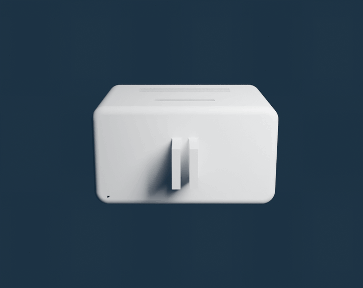
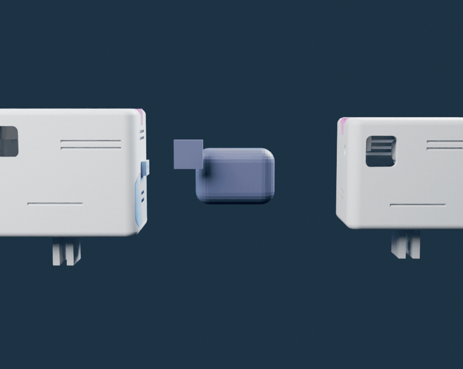

<div align="center">

# SkyLive

### A skydiver exits at 4 000 m. Before the canopy opens, the drop zone is already watching through their eyes.

**Live from 4 km — 14 ms behind reality.**



<sub>the actual gate-verified CAD, spinning — poke it yourself in the [3D Lab](https://schoentom.github.io/skylive/viewer.html)</sub>

[](#status)
[](LICENSE)
[](build/cad/)
[](https://schoentom.github.io/skylive/)

**[▶ Play the jump](https://schoentom.github.io/skylive/)** · **[🧊 3D Lab](https://schoentom.github.io/skylive/viewer.html)** · **[🪂 Freefall Simulator](https://schoentom.github.io/skylive/freefall.html)** · **[🚧 Gate Simulator](https://schoentom.github.io/skylive/gates.html)** · **[⚖ vs GoPro](https://schoentom.github.io/skylive/viewer.html)** · **[🎛 Antenna decks](https://schoentom.github.io/skylive/decks/)** · **[Build it — one page](build/QUICKSTART.md)** · **[What the gates caught](build/WHAT_THE_GATES_CAUGHT.md)** · **[The numbers](build/rf/README.md)** · **[Legal (DE)](build/LEGAL_DE.md)**

</div>

---

## What if the whole drop zone could watch — live?

<div align="center">

</div>

Today the ground sees **a dot in the sky**. Spectators, the waiting area, your own team — they follow the jump with the naked eye, and the footage arrives only *after* landing. The moment itself stays invisible.

**SkyLive** puts the jump on the screen **as it happens**. A helmet-mounted transmitter the size of an action cam sends a digital HDZero picture from ~4 km up, down its own 5.8 GHz radio link — no internet, ~14 ms — straight onto the big TV in the waiting area. Not a recording. **The present tense.**

<div align="center">

</div>

---

## Four parts. Zero solder joints.

That's the entire transmitter: **a radio, a camera, a battery, and a button** — joined without a soldering iron. The simplicity *is* the design.

| | part | what it does | the real part |
|---|---|---|---|
| 📡 | **Radio (VTX)** | turns the picture into a 1 W digital signal, ~14 ms | HDZero Freestyle V2 (30 × 29 × 14 mm, runs directly on 3S — no flight controller, no BEC) |
| 👁 | **Camera** | HD skydive POV, 162° | HDZero Nano90 (ships in the VTX kit, powered over its MIPI cable) |
| 🔋 | **Battery** | ~40 min at 1 W (calculated: 850 mAh / ~1.3 A) | Tattu R-Line 3S 850 mAh (XT30) |
| 🔘 | **Switch** | on/off — breaks the battery + line directly | 12 mm latching push-button, panel-mount |

Power joins are **three Wago 221-412 lever clamps** — strip, flip the lever, clamp, done. Re-openable in seconds, no cold joints, no fumes. The VTX side plugs in via its stock **JST-GH 6-pin harness**. Full step-by-step (with the three hardware-killer rules): **[`build/BUILD_GUIDE.md`](build/BUILD_GUIDE.md)**.

**The shell:** an upright, two-storey GoPro-style case — battery downstairs behind its own tab-locked door, radio + camera upstairs under a screwed roof lid — printed in **PETG/ASA (never PLA)** with a sacrosanct **3 mm wall**, long passive louver vents, and a GoPro mount underneath. Outer dimensions: **71 × 39.5 × 56 mm** — genuinely action-cam-sized. Both short sides carry an identical **T-slot strain-relief interface** at the top edge, so the antenna can anchor left or right; the unused side closes with a blind T-piece. It builds from the parametric script in [`build/cad/`](build/cad/) and passes every geometry gate on each rebuild; this exact file set is what went to the printer.



**Two sizes, one architecture.** Don't take a photo's word for it — **[spin both in the 3D Lab](https://schoentom.github.io/skylive/viewer.html)**, where every dimension tag is a real millimetre from the executed CAD. The **850** (71 × 39.5 × 56 mm) is the flight unit; the
**Mini 300** (59.5 × 39.5 × 48 mm, −28 % volume) is the same design wrapped around a 300 mAh pack —
same T-slot antenna anchors (literally the same printed T-piece), same tab door, same camera corner.
The width stays 39.5 on both because the radio and camera set it, not the battery.

<div align="center">

</div>

---

## One antenna, anchored like a tool — not like an afterthought.

There is **no electronic antenna switch** on the sender — the omni rides outside on its
semi-rigid coax, and the clever part lives where it belongs: on the ground.

The mount is the oldest trick in the book, done properly: a **2.9 mm press-fit slot** in the top
edge of the case wall grips the **Ø 3.1 mm** semi-rigid with −0.2 mm of interference — a yank on
the antenna loads the printed wall, never the connector. A flat **T-piece** covers the slot and
locks with two vertical M2 cap screws; the cable rises through its notch and the
**RHCP omni stands above the case**, clear of the helmet. Both short sides carry the identical
interface, so the anchor moves left or right to suit the helmet setup — the unused side closes
with a **blind T-piece** and the case is fully sealed even with no antenna fitted.

| honest caveat | status |
|---|---|
| Body shadow, not the antenna, is the limiter in belly/sit poses (−7…−12 dB literature midpoints) | assumption, to be jumped |
| Press-fit holding force and S11 with the coax clamped | `MEASURE_ME` — fit-print + NanoVNA |

Two earlier antenna integrations — the fully **encapsulated side-capsule omni** and the
**down-firing patch shell** — are preserved as engineering studies with their full RF derivations
in [`build/ENGINEERING/antenna_capsule.md`](build/ENGINEERING/antenna_capsule.md); the external
anchored omni won on serviceability (swap an antenna in seconds, nothing to detune, one part to
reprint).

**The gain lives on the ground.** You're tumbling; the ground isn't. A bigger helmet antenna buys ~2–3 dB; *aiming* the ground antenna buys 10–14 dB. So the ground station is an **HDZero BoxPro** (4-way diversity, HDMI out to the TV) with an aimed **TrueRC X²-AIR patch** (nominal 13 dBic — honestly, expect ~10), a **Double AXII 2 LR** horizon omni and a **Matchstick** overhead omni. The receiver rides the best branch, frame by frame.

---

## The numbers — calculated, labelled, and published even when they got worse

<div align="center">

</div>

| | value | status |
|---|---|---|
| 📡 Transmit power | +30 dBm (1 W) — 25 mW SRD for all tests, PMSE assignment for the event | planned path |
| 📡 Free-space loss @ 4 km | 119.8 dB (5.8 GHz, Friis) | derived |
| 📡 Link margin @ 4 km | **head-down ≈ +9 dB** · back ≈ +3 dB · **belly rides the threshold** (−0.2 dB) · sit ≈ −2 dB — margins improve 2–3 dB per km of descent | **calculated, not measured** |
| 🧍 Body shadow | −7…−12 dB with the side-mount offset (literature midpoints) — the single biggest uncertainty | assumption, to be jumped |
| 🌡 Heat at 1 W | **~13 W of waste heat.** On the ground, in still air, no passive case can hold that — so the doctrine is 25 mW on the ground, **1 W only at door-open**; in freefall the 200 km/h wind is the heatsink (4–8× surplus) | calculated |
| ⏱ Latency | ~14 ms | manufacturer figure |

The full model — pattern math, pose-by-pose margin tables, every assumption and its direction of error — is in [`build/rf/`](build/rf/), including an **interactive link-budget explorer** you can open in any browser. The thermal, structural and print derivations live in [`build/ENGINEERING/`](build/ENGINEERING/).

> **No overclaiming.** A CAD boolean check is not a test. Nothing in this repo carries a *measured* badge yet — and when the 2026 recalculations made numbers worse, the worse numbers were published.

---

## Build one yourself

Everything a re-builder needs is under [`build/`](build/):

- 📋 **[`BUILD_GUIDE.md`](build/BUILD_GUIDE.md)** — the solder-free assembly, the wiring map, the three hardware-killer rules, and the power/thermal operating doctrine.
- 🛒 **[`BOM.md`](build/BOM.md)** — every part with real EU prices (as of 2026-07).
- 📐 **[`MEASURE.md`](build/MEASURE.md)** — the dimensions you must caliper yourself (nothing in this project is guessed).
- ✅ **[`VERIFICATION.md`](build/VERIFICATION.md)** — how a CAD model is turned into a *trustworthy* printable part: a seven-layer defense-in-depth, the honest limits of gates vs. physical tests, and the release checklist.
- ⚖️ **[`LEGAL_DE.md`](build/LEGAL_DE.md)** — the German regulatory situation, honestly: what is legal today (25 mW SRD), what the event path is (PMSE), and why 1 W under an amateur licence is locked pending clarification.
- 🧊 **[`cad/`](build/cad/)** — the parametric build123d scripts (`spec.py` is the single source of truth for every dimension).

<div align="center">

</div>

---

## Status

**Print released** (2026-07). The concept, the electronics, the RF doctrine and the engineering derivations are done and published here; the case design is frozen and the first fit-print is in the lab.

- ✅ Sender electronics bought and specified — four parts, solder-free.
- ✅ RF doctrine derived and published (donut orientation, ground diversity, capsule study) — *calculated*.
- ✅ Thermal, structural and print-factor derivations published — *calculated*.
- ✅ Final case CAD (**71 × 39.5 × 56 mm**) builds watertight and passes every geometry gate — roof lid on 3 corner inserts, tab-locked battery door, twin T-slot antenna anchors, 3 mm wall. **Print files released; the first fit-print is on the printer.** *Geometry-verified, not yet a physical test.*
- ✅ **Mini-300 variant** (59.5 × 39.5 × 48 mm, Tattu 300 3S HV): full architecture port of the final build — same T-slot anchors (the T-pieces are literally the same printed part), same tab door, no power switch (the electronics storey has no room for one; power = plug the battery). [`build/cad/mini_300.py`](build/cad/mini_300.py), *geometry-verified, not yet printed.*
- 🔜 Then: fit-print feedback → thermal measurement (multimeter protocol is written) → antenna S11 with the coax clamped → 25 mW range test → test jump.

⭐ **Star the repo** — releases will carry the first real measurements and, eventually, the first freefall footage from the system itself. Building one, or flying camera and have opinions? Open an [issue](https://github.com/SchoenTom/skylive/issues).

---

## The jump, as a number line

```
4000 m ─┤ ██ EXIT      link margin: head-down +9 dB · belly −0.2 dB   [CALC]
3000 m ─┤ ██ freefall  ~200 km/h — the airstream IS the heatsink      [CALC]
1500 m ─┤ ██ canopy    margins improve 2–3 dB per km of descent       [CALC]
 300 m ─┤ ██ pattern   ground diversity rides the best of 4 antennas
   0 m ─┴─▓▓─ beer     footage was live the whole way down            [PLAN]
```

## Truth ledger — what is measured, what is math

The whole repo runs on a two-word doctrine: **a CAD boolean is not a test.** Current state of
every load-bearing number:

| number | value | status |
|---|---|---|
| case dimensions, both senders | 71×39.5×56 · 59.5×39.5×48 | 🟢 executed CAD, gate-checked |
| battery | 58×30×22 (850) · 45×17.5×15.3 (Mini) | 🟢 measured with calipers |
| brass inserts | M3 Ø5×6 · M2 Ø3.2×3 | 🟢 measured |
| XT30 wire, coax jacket | Ø2.8 · Ø3.1 | 🟢 measured |
| GoPro teeth 3.0 / gap 3.3 | first fit-print in progress | 🟡 printing now |
| clamp holding force (2.9 slot) | −0.2 mm interference | 🔴 MEASURE_ME — pull test pending |
| antenna S11, insert strength, snap cycles | — | 🔴 MEASURE_ME |
| link budget @ 4 km, thermal model | full derivations in build/rf | 🟡 CALC — to be jumped |

🟢 measured · 🟡 calculated/derived and labelled · 🔴 open, honestly. When the 2026 recalculations
made numbers worse, the worse numbers were published — that policy stands.

## Honest note

A solo-built, prototype-stage project shared in full. Calculated values are marked as such and separated from what still has to be measured. Transmit power is regulated: the plan of record is licence-free **25 mW SRD** for all development tests and a **PMSE short-term frequency assignment** for event operation — see [`DISCLAIMER.md`](DISCLAIMER.md) and [`build/LEGAL_DE.md`](build/LEGAL_DE.md).

<sub>License: <a href="LICENSE">CC-BY-4.0</a> · CAD: build123d (Python) · Made by <a href="https://github.com/SchoenTom">@SchoenTom</a></sub>
