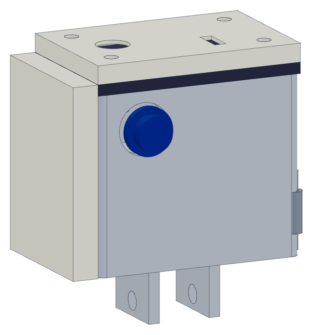
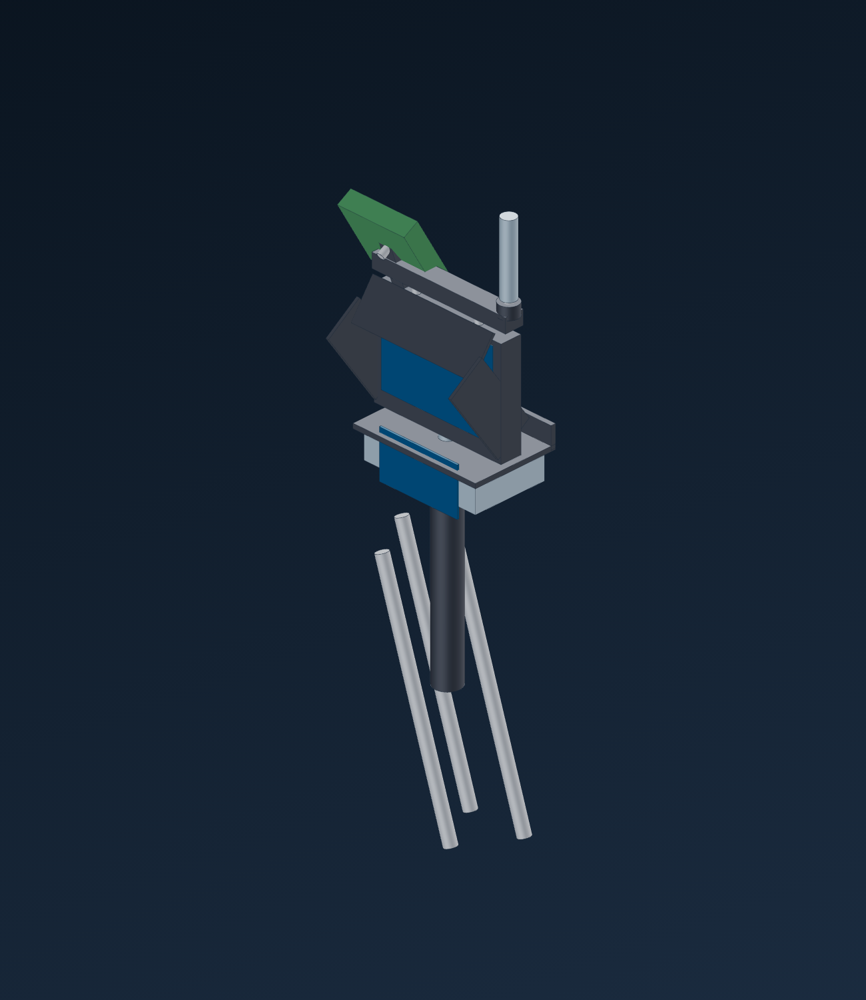
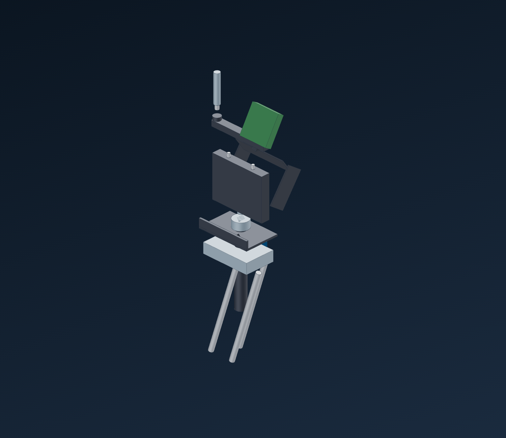
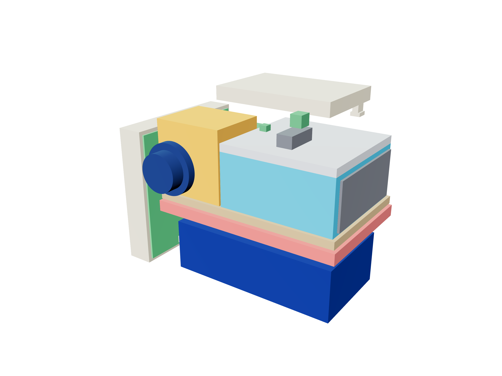
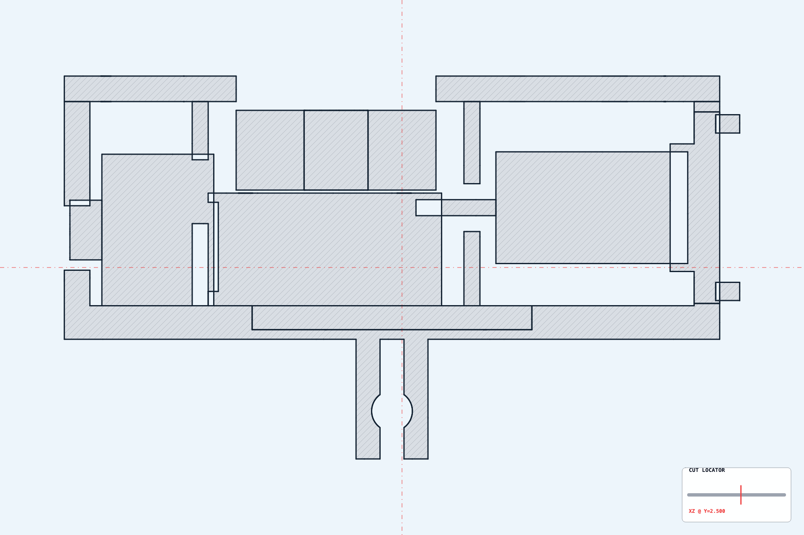
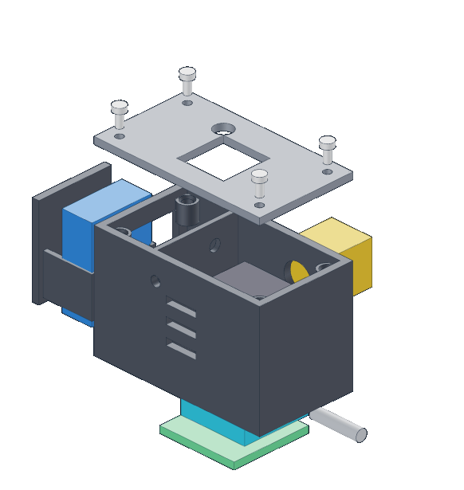

<!-- ENTWURF — lokal, noch nicht veröffentlicht. Inhalt/Stil frei anpassen. -->

<h1 align="center">SkyDive·Live</h1>

<p align="center">
  <b>Ein 1‑Watt‑HDZero‑Live‑Stream‑Sender im Action‑Cam‑Format für den Profi‑Fallschirmsport —<br>
  der Blick des Springers aus 4 000 m, live auf den Bildschirm an der Landezone.</b>
</p>

<p align="center">
  🇬🇧 <i>A custom HDZero 1 W live‑stream transmitter for professional skydiving: the jumper's POV, live from 4 km up to the drop zone — plus a diversity ground station. Self‑contained, helmet‑mounted, engineered from the link budget up.</i>
</p>

<p align="center">
  
  
</p>

<p align="center">
  <sub>Stand: <b>Konzept &amp; Prototyping</b> — jeder kritische Pfad ist durchgerechnet und mit Reserve ausgelegt; die Bilder sind CAD-Renderings. Der gebaute Prototyp + die Messungen sind der nächste Schritt.</sub>
</p>

---

## Die Idee

Bestehende Skydive‑Livestreaming‑Lösungen sind sperrig, teuer oder reichweiten‑/latenzschwach. SkyDive·Live verfolgt bewusst den **kleinen, robusten, eigenständigen** Weg: ein helmgetragenes Gerät im GoPro‑Formfaktor, das im Freifall ein **digitales HDZero‑Bild** zur Drop Zone funkt — für Wettkampf‑Public‑Viewing, Coaching und Medien.

## Das System — zwei Teile, ein Datenfluss

```
Kamera (MIPI) → VTX 1 W → U.FL → Antenne(n) → ~4 000 m Luft → Boden-Antennen-Array → Diversity-RX → HDMI → Monitor / Public Viewing
```

| **① Sender** (am Helm) | **② Bodenstation** (an der Landezone) |
|---|---|
| HDZero‑1W‑VTX + Micro‑Kamera | HDZero‑VRX4 **Diversity**-Empfänger (4× SMA) |
| 3S‑LiPo, seitlich wechselbar | 2–3 Richt‑Patches (↑) + 1–2 Omni (Nahbereich) |
| Patch‑Antenne (+ λ/2‑Dipol für Head‑down) | HDMI‑Recorder (garantierter Mitschnitt) |
| Alu‑Korpus = Struktur + Kühlkörper + Ground‑Plane | Glasfaser‑HDMI → Public‑Viewing‑Screen |

<p align="center">
  
  
</p>

Die eigentliche Robustheit liegt **am Boden**: der Diversity‑Empfänger wählt automatisch das stärkste von mehreren Antennensignalen — derselbe Ansatz wie professionelle Systeme (Fastrax, Vislink).

### Innenleben

<p align="center">
  
  
</p>

<p align="center"><sub>Röntgen-Ansicht &amp; bemaßter Querschnitt — jeder Block hat seinen Platz, thermisch und HF-technisch begründet.</sub></p>

> 🧊 **In 3D drehen:** das Modell live im Browser → <a href="https://schoentom.github.io/skydive-live">schoentom.github.io/skydive-live</a> (zusammengebaut ↔ Explosion umschaltbar).

## Die Zahlen, die zählen → [`ENGINEERING.md`](ENGINEERING.md)

Das hier ist kein Bastel‑Glücksspiel. Jeder kritische Pfad ist durchgerechnet:

| | Wert | |
|---|---|---|
| 📡 **Sendeleistung** | +30 dBm (1 W) — ≪ 5 W Klasse‑E‑Limit | konform |
| 📡 **Freiraumdämpfung @ 4 km** | 119,8 dB (5,8 GHz) | Formel ✅ |
| 📡 **Link‑Reserve (Belly‑Lage)** | **+13,2 dB** | berechnet |
| 🌡 **Thermik im Freifall** (200 km/h) | ΔT **≈ 6 K** (R_th 0,43 K/W) | berechnet |
| 🔋 **Laufzeit** | ~40 min theoret. / ~32 min praktisch | dimensioniert |
| ⚖️ **Masse Sender** | ~200–250 g | dimensioniert |

> **Der harte Fall (Head‑down)** ist erkannt und gelöst: −29 dB Strafe → Dual‑Antenne am Sender **+** Diversity am Boden. **Die Margen sind so ausgelegt, dass die offenen Messungen den Entwurf bestätigen sollten** — ehrliche Trennung „berechnet vs. zu messen" in [`ENGINEERING.md`](ENGINEERING.md).

## Selber bauen → [`BUILD.md`](BUILD.md)

Vollständige Schritt‑für‑Schritt‑Anleitung für den Sender:

**① 3D‑Druck** (PETG, verifizierte STLs) → **② Bauteile vorbereiten** → **③ Montage‑Stack** (Antenne → VTX flach → Kamera → Cover) → **④ Verkabelung & Strom** (MOSFET‑Schaltung, Conformal Coating) → **⑤ Passungstests A–F** (Maß, Tray, Thermik‑Spalt, Gesamtmontage).

<p align="center"></p>
<p align="center"><sub>Montage-Sequenz — jeder Schritt einzeln in <a href="BUILD.md"><code>BUILD.md</code></a>.</sub></p>

## Mehr

- 📋 **[`BOM.md`](BOM.md)** — vollständige Stückliste (Sender, Bodenstation, Messtechnik)
- 🎞 **Pitch‑Decks** — [DE](decks/pitch_DE.html) · [EN](decks/pitch_EN.html) (self‑contained, mit 3D‑Viewer)
- 🧊 **3D‑Modelle** (GLB): [Sender](models/sender_assembled.glb) · [Explosion](models/sender_exploded.glb) · [Bodenstation](models/groundstation.glb) — oder **[live in 3D drehen](https://schoentom.github.io/skydive-live)**

## Ehrliche Einordnung

Ambitioniertes Engineering‑Projekt **in Entwicklung** — kein Serienprodukt, keine abgeschlossene Validierung. **Abgenommen:** CAD (watertight, 0 Kollisionen, Befestigung 7/7), elektrische Kompatibilität auf Papier, alle Budgets durchgerechnet. **Offen (nächster Schritt):** erster Druck, Thermik‑Messung am VTX, S11‑Messung, Testsprung.

## Engineering‑Stack

`OpenSCAD` (parametrisches CAD) · `Python` (Build‑/Verify‑Pipeline) · RF‑Link‑Budget · Thermik (Konvektions‑/Flachplatten‑Rechnung) · Regulatorik (AFuV / Klasse E) · DFM für FDM‑Druck.

<sub>Renders &amp; 3D: eigenes CAD. Fragen / Kollaboration willkommen.</sub>
