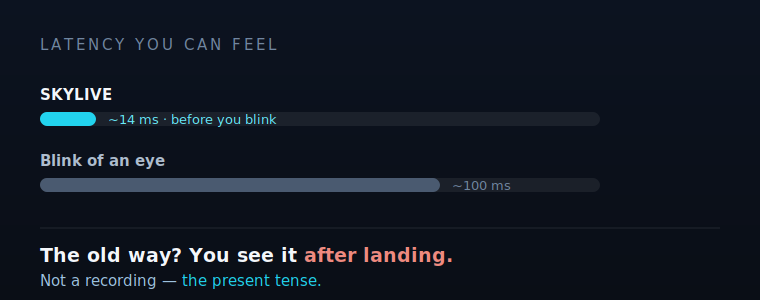

<!-- TBD-CAD-M6: hero render of the rebuilt sender (lens forward, donut-omni nose on the side) lands here as renders/hero.png -->

# SkyLive

### The jump. Live. — the whole drop zone watches, as it happens.

**[▶ Play the jump](https://schoentom.github.io/skydive-live/#antenna)** · **[Build it](build/BUILD_GUIDE.md)** · **[The numbers](build/rf/README.md)** · **[Legal (DE)](build/LEGAL_DE.md)**

---

## What if the whole drop zone could watch — live?

Today the ground sees **a dot in the sky**. Spectators, the waiting area, your own team — they follow the jump with the naked eye, and the footage arrives only *after* landing. The moment itself stays invisible.

**SkyLive** puts the jump on the screen **as it happens**. A helmet-mounted transmitter the size of an action cam sends a digital HDZero picture from ~4 km up, down its own 5.8 GHz radio link — no internet, ~14 ms — straight onto the big TV in the waiting area. Not a recording. **The present tense.**

---

## Four parts. Zero solder joints.

That's the entire transmitter: **a radio, a camera, a battery, and a button** — joined without a soldering iron. The simplicity *is* the design.

| | part | what it does | the real part |
|---|---|---|---|
| 📡 | **Radio (VTX)** | turns the picture into a 1 W digital signal, ~14 ms | HDZero Freestyle V2 (30 × 29 × 14 mm, runs directly on 3S — no flight controller, no BEC) |
| 👁 | **Camera** | HD skydive POV, 162° | HDZero Nano90 (ships in the VTX kit, powered over its MIPI cable) |
| 🔋 | **Battery** | ~40 min at 1 W (calculated: 850 mAh / ~1.3 A) | Tattu R-Line 3S 850 mAh (XT30) |
| 🔘 | **Switch** | on/off — breaks the battery + line directly | 12 mm latching push-button, panel-mount |

Power joins are **three Wago 221-412 lever clamps** — strip, flip the lever, clamp, done. Re-openable in seconds, no cold joints, no fumes. The VTX side plugs in via its stock **JST-GH 6-pin harness**. Full step-by-step (with the three hardware-killer rules): **[`build/BUILD_GUIDE.md`](build/BUILD_GUIDE.md)**.

**The shell:** an upright, two-storey GoPro-style case — battery downstairs, radio + camera upstairs — printed in **PETG/ASA (never PLA)** with a sacrosanct **3 mm wall**, passive louver vents, and a GoPro mount underneath. Final outer dimensions: `TBD-CAD-M6` (the CAD rebuild is running its gates now — the parametric scripts are already in [`build/cad/`](build/cad/)).

---

## One socket. Two antennas. No silicon in between.

There is **no electronic antenna switch** on the sender — you pick the antenna for the jump by hand, and the clever part lives where it belongs: on the ground.

| | **A — the donut omni** (primary) | **B — the down patch** (variant) |
|---|---|---|
| **What** | Lumenier AXII 2 RHCP omni, **fully encapsulated** in a printed nose in the side wall | TBS 5G8 RHCP patch inside the bottom shell, radiating down through a 1.5 mm radome |
| **How it radiates** | lying with its axis **across the body** — the donut pattern fires **down + up**, nulls point out to the sides | a ~110° cone aimed at the ground |
| **Why** | the ground station is *below* you; aiming the donut down instead of at the horizon is worth **~15–18 dB** at 4 km — better aiming, not more power *(calculated)* | belly-fly with the DZ below/ahead |
| **Honest caveat** | body shadow, not the antenna, is the limiter in belly/sit poses | swings off-target the moment you go head-down |

Encapsulating the omni costs almost nothing in RF (PETG radome, the antenna's own 900 MHz bandwidth is the reserve — *NanoVNA verification is mandatory before believing this*) and removes wind load, fatigue and line-snag risk entirely. Full derivation: [`build/ENGINEERING/antenna_capsule.md`](build/ENGINEERING/antenna_capsule.md).

**The gain lives on the ground.** You're tumbling; the ground isn't. A bigger helmet antenna buys ~2–3 dB; *aiming* the ground antenna buys 10–14 dB. So the ground station is an **HDZero BoxPro** (4-way diversity, HDMI out to the TV) with an aimed **TrueRC X²-AIR patch** (nominal 13 dBic — honestly, expect ~10), a **Double AXII 2 LR** horizon omni and a **Matchstick** overhead omni. The receiver rides the best branch, frame by frame.

---

## The numbers — calculated, labelled, and published even when they got worse

| | value | status |
|---|---|---|
| 📡 Transmit power | +30 dBm (1 W) — 25 mW SRD for all tests, PMSE assignment for the event | planned path |
| 📡 Free-space loss @ 4 km | 119.8 dB (5.8 GHz, Friis) | derived |
| 📡 Link margin @ 4 km | **head-down ≈ +9 dB** · back ≈ +3 dB · **belly rides the threshold** (−0.2 dB) · sit ≈ −2 dB — margins improve 2–3 dB per km of descent | **calculated, not measured** |
| 🧍 Body shadow | −7…−12 dB with the side-mount offset (literature midpoints) — the single biggest uncertainty | assumption, to be jumped |
| 🌡 Heat at 1 W | **~13 W of waste heat.** On the ground, in still air, no passive case can hold that — so the doctrine is 25 mW on the ground, **1 W only at door-open**; in freefall the 200 km/h wind is the heatsink (4–8× surplus) | calculated |
| ⏱ Latency | ~14 ms | manufacturer figure |

The full model — pattern math, pose-by-pose margin tables, every assumption and its direction of error — is in [`build/rf/`](build/rf/), including an **interactive link-budget explorer** you can open in any browser. The thermal, structural and print derivations live in [`build/ENGINEERING/`](build/ENGINEERING/).

> **No overclaiming.** A CAD boolean check is not a test. Nothing in this repo carries a *measured* badge yet — and when the 2026 recalculations made numbers worse, the worse numbers were published.

---

## Build one yourself

Everything a re-builder needs is under [`build/`](build/):

- 📋 **[`BUILD_GUIDE.md`](build/BUILD_GUIDE.md)** — the solder-free assembly, the wiring map, the three hardware-killer rules, and the power/thermal operating doctrine.
- 🛒 **[`BOM.md`](build/BOM.md)** — every part with real EU prices (as of 2026-07).
- 📐 **[`MEASURE.md`](build/MEASURE.md)** — the dimensions you must caliper yourself (nothing in this project is guessed).
- ⚖️ **[`LEGAL_DE.md`](build/LEGAL_DE.md)** — the German regulatory situation, honestly: what is legal today (25 mW SRD), what the event path is (PMSE), and why 1 W under an amateur licence is locked pending clarification.
- 🧊 **[`cad/`](build/cad/)** — the parametric build123d scripts (`spec.py` is the single source of truth for every dimension).

---

## Status

**Full redesign in progress** (2026-07). The concept, the electronics, the RF doctrine and the engineering derivations are done and published here; the printed case is in its final CAD pass.

- ✅ Sender electronics bought and specified — four parts, solder-free.
- ✅ RF doctrine derived and published (donut orientation, capsule, ground diversity) — *calculated*.
- ✅ Thermal, structural and print-factor derivations published — *calculated*.
- 🔄 Final case CAD running its gates → new renders, GLBs and outer dimensions land as `TBD-CAD-M6` markers resolve.
- 🔜 Then: print → thermal measurement (multimeter protocol is written) → antenna S11 in the capsule → 25 mW range test → test jump.

⭐ **Star the repo** — releases will carry the first real measurements and, eventually, the first freefall footage from the system itself. Building one, or flying camera and have opinions? Open an [issue](https://github.com/SchoenTom/skydive-live/issues).

---

## Honest note

A solo-built, prototype-stage project shared in full. Calculated values are marked as such and separated from what still has to be measured. Transmit power is regulated: the plan of record is licence-free **25 mW SRD** for all development tests and a **PMSE short-term frequency assignment** for event operation — see [`DISCLAIMER.md`](DISCLAIMER.md) and [`build/LEGAL_DE.md`](build/LEGAL_DE.md).

License: <a href="LICENSE">CC-BY-4.0</a> · CAD: build123d (Python) · Made by <a href="https://github.com/SchoenTom">@SchoenTom</a>
