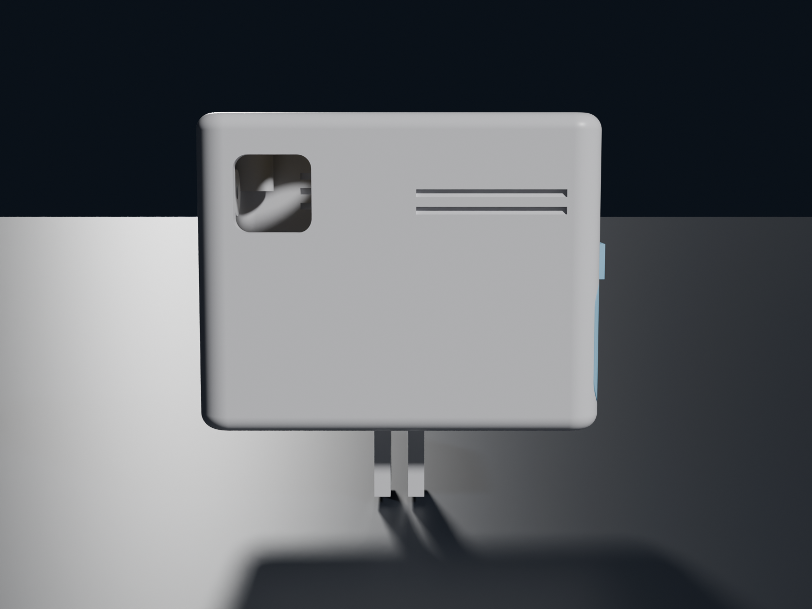
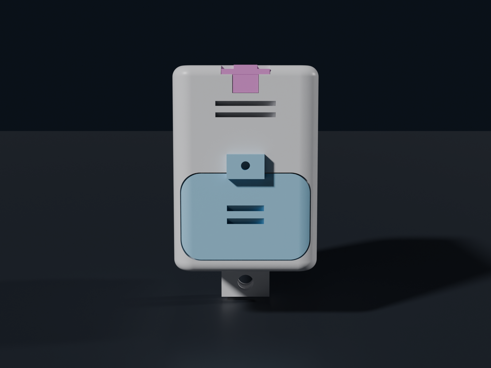

# SkyLive — Assembly, step by step (the fiddly bits)

*The close-up companion to [`BUILD_GUIDE.md`](BUILD_GUIDE.md). Where the build guide gives you the
system and the wiring map, this file walks the **hand movements** — the ones that go wrong the
first time if nobody warns you. Each step is written as **Do / Why / Watch out (the failure it
produces)**, in the order you actually work.*

*Labels, same discipline as the rest of the repo: sourced numbers carry their origin, **[CALC]** =
calculated, `MEASURE_ME` = you must caliper your own part, **`TBD-ASSET`** = a photo/render or a
still-open, model-dependent number that lands when the final CAD pass closes. **Nothing here
carries a "measured" badge yet** — the reference prototype prints and fits; the numbers below are
spec-locked, not bench-proven. A CAD boolean is not a test.*

> ⚠️ Read [`LEGAL_DE.md`](LEGAL_DE.md) before any transmit. All development is **25 mW SRD**;
> 1 W is the event-only PMSE path. And read the three hardware-killer rules in
> [`BUILD_GUIDE.md` § 6](BUILD_GUIDE.md#6--hardware-killers-never-skip) before you power anything.

---

## Before you start — the two-minute inventory

The four functional parts (VTX, camera, battery, switch), the **U.FL→SMA flange pigtail**, the
donut omni, the **1.5 mm thermal pad**, and the printed parts: **body** (one piece — both
storeys and the divider shelf print as one), **roof lid**, **battery door**, **2× XT30 clamp
bar**, **2× strain-relief T-piece**. Plus the small-parts bag (**M2 & M3 brass heat-set inserts,
M2 & M3 DIN 912 cap screws**) and the tools: **soldering iron** (inserts, the XT30, and — on the
recommended flight build — the power joins; the Wago quick-build path needs **3× Wago 221-412**
instead), a multimeter, an 8 mm wrench for the SMA, hot glue/RTV, a caliper.

> Order note: seat the **heat-set inserts first** (they need a hot iron and an empty shell),
> then do all the cold work. Never run the iron near a seated battery or the VTX.

*(Photo lands with the first physical build log — every claim above comes from the executed CAD, not a stock image.)*
---

## Step 1 · Melt the brass inserts (3× M3 roof posts + 1× M2 door latch)

**Do.** The shell prints with **Ø 4.6 mm insert holes** in **Ø 8 mm corner posts** under the roof opening (3 posts — the camera owns the fourth corner),
each with a small **Ø 5.2 × 0.5 mm lead-in chamfer** on top. Set the soldering iron to
**250–270 °C** (rule: print temperature **+10…20 °C** — hot enough to melt PETG, not scorch it).
Sit a brass insert (**Ø 5.0 mm OD × 6.0 mm long**, measured on the reference part) on the chamfer,
put the iron tip **flat into the insert's bore from directly above**, and let *its own weight plus
the lightest push* sink it. Keep the iron **dead vertical**. Stop when the insert sits **~0.3 mm
below flush** (sub-flush, so the lid face seats on plastic, not on brass). Withdraw the iron
straight up; a wet fingertip or a flat cold tool can true the top while the plastic is still soft.

**Also:** one **M2 brass insert (Ø 3.2 OD × 3.0 long, measured)** goes into the **Ø 2.8 hole
above the battery opening** (axis horizontal, set from outside — the door tab covers its mouth
later). Same technique, smaller iron tip. This is the most-cycled thread in the whole device
(every battery swap), which is exactly why it gets brass instead of self-tapped PETG.

**Why.** A cold-pressed insert splits the boss; a heat-set one melts the plastic into its knurl and
locks in. The **Ø 4.6 hole is a deliberate ~0.4 mm undersize** vs the 5.0 insert — the displaced
melt is what grips the knurl. Each **Ø 8 post is welded into its case corner**, so the corner walls
carry the load with it. Sub-flush by 0.3 keeps the sealing face clean.
(All geometry [CALC] from standard heat-set guidance + the measured insert; **fit is
bench-verified pending** the first real melt.)

**Watch out.**
- **Brass blob / plastic welling up over the rim** → iron too hot or pushed too hard. It's sunk too
  far and the boss face is fouled. Back off temperature, let it cool, pare the blob flush.
- **Insert goes in tilted (skew)** → the iron wasn't vertical, or you pushed off-axis. A tilted
  insert cross-threads the M3 later. Reheat, push it upright against a flat block, re-true.
- **Insert won't sink / plastic barely softens** → iron too cold or hole printed under-size; give it
  temperature, not force — forcing a cold insert cracks the boss.
- **Insert spins in the hole afterwards** → over-heated, the melt reflowed too loose. That boss is
  compromised; the honest fix is to plug and reprint, not to glue.

There are **3× M3 inserts** under the roof opening — three corners carry the lid; the fourth
corner belongs to the camera, where the rebate lip holds instead (an asymmetry the reference
prototype shares). The battery bay keeps its own door on the end face.
*(Photo lands with the first physical build log — every claim above comes from the executed CAD, not a stock image.)*
---

## Step 2 · Clamp the antenna coax under the T-piece nose (the screws are the clamp)

*(The anchored omni is the standard build. A down-firing patch and an encapsulated capsule exist
only as legacy engineering studies — [`ENGINEERING/antenna_capsule.md`](ENGINEERING/antenna_capsule.md).)*

**Do.** Both short sides carry the same interface, measured 1:1 off a working reference build:
from the top edge, a **mouth** (18 × 2.5 — the T's crossbar seat), a **3.3 mm guide slot**, and
at the bottom a **round Ø 3.2 seat** passing horizontally through the wall. **Lay the Ø 3.1 mm
semi-rigid coax in from above** (never thread a connector through a closed hole) and let it drop
**all the way down** into the seat — it goes in easily; the seat has clearance *by design*. The
cable now runs horizontally through the wall and out; outside, the **omni sits directly against
the wall, axis horizontal, pointing straight through it** — donut fires down/up/all around
instead of aiming a pattern null at the ground. Now slide the **T-piece** down the slot: its stem
ends in a **convex R 1.55 nose** (exactly the cable radius) that lands on top of the cable.
Drive the **2× M2×8 cap screws, vertical, heads up** — they pull the nose **0.4 mm down onto the
cable**: *that* is the clamp. One T-piece design, printed twice, both sides identical — nothing
to drill or notch, pick either side. On the unused side the T seals the mouth and slot; two
small crescent openings of the empty seat remain under the nose (vent-sized, stated honestly).

**Why.** A screw-driven nose clamp holds by bolt tension, not by print tolerance: the seat's
clearance means the cable never fights its way in (no jacket damage, no detuning on insertion),
and the clamping force is whatever the two M2s deliver — repeatable, serviceable, releasable.
A yank on the antenna loads the printed wall and the bolted nose, never the solder or the
connector. The CAD asserts a 0.4 mm nose engagement (1.15 mm³ interference) on every rebuild —
that's a geometry check; the actual holding force is your pull test.

**Watch out.**
- **Cable slides under firm pull** → screws not torqued, or the nose isn't reaching (cable not
  fully down in the seat). Back the T out, re-seat the cable to the bottom, re-drive.
- **T-piece stops proud of the roof edge** → the nose met the cable early (cable riding high) or
  grit in the slot — never force it; the crossbar must land flush in the mouth.
- **Coax jacket visibly crushed at the nose** → over-torqued. The M2s need firm hands, not
  gorilla torque; the nose is shaped to cradle, not to cut.

Then form the coax's **single 90° bend (R ≥ 8 mm)** once, by hand on the printed jig, and mate the
**SMA** to the internal jack (8 mm wrench, firm — not gorilla-tight). The fragile **U.FL is touched
exactly once** at the pigtail and never again. 

`DONE-ASSET` — CAD render above; a cross-section →
renders/steps/02_coax_clamp.png; final block dimensions confirm with the CAD pass.

---

## Step 3 · Seat the VTX against the thermal pad

**Do.** Peel one face of the **1.5 mm silicone thermal pad (≥ 3 W/mK)** and stick it to the
**inside of the case wall** opposite the antenna side. Seat the VTX with its **hottest face flat
against the pad**, no air gap, and let the printed shelf/ribs locate it. The VTX is **not** screwed
to the wall — the pad's tack plus the shelf hold it; the wiring dresses last.

**Why.** At 1 W the VTX is the hottest thing in the box (~90 °C in ~2 min in a closed case on the
bench, [CALC]). The pad is a **mandatory** second heat path into the wall — on the ground it only
moves ~0.6 W, but it buys 1–2 minutes in the power-up window and carries ~2.5 W in freefall
([CALC], derivation in [`ENGINEERING/thermal.md`](ENGINEERING/thermal.md)).

**Watch out.**
- **Air gap behind the VTX** → pad not compressed, thermal path is fiction. You should see the pad
  *slightly* squished when seated.
- **Pad on the wrong face** → it must touch the VTX's heat-spreader face, not the connector side.
- **Never bench-power the VTX in the closed case at > 25 mW for more than a minute or two** — it
  will over-temp and RF-cut. That's expected behaviour, not a fault.

*(Photo lands with the first physical build log — every claim above comes from the executed CAD, not a stock image.)*
---

## Step 4 · Camera + MIPI

**Do.** Sit the camera in its printed cradle with the **lens looking out through the wall opening**
(outer face essentially flush/snag-free). Route the **20-pin MIPI ribbon** to the VTX and seat the
connector squarely. The camera is retained from **inside** by an **M2 DIN 912 cap screw** in a
counterbore sized so the head fully sinks (**Ø 4.4 × 2.4 mm counterbore** for the Ø 3.8 × 2.0 mm M2
head — the project screw standard).

**Why.** Inverting the *mounting* structure inward (lens still out) keeps the outside clean and the
camera captured; the counterbore keeps the screw head below the surface so nothing snags. The camera
is powered **over the MIPI by the VTX** — there is no separate camera wire.

**Watch out.**
- **MIPI seated at an angle / half-in** → the ribbon is fragile and the contact is finicky; a dark
  or glitchy picture is almost always the MIPI, not the camera. Re-seat gently, straight in.
- **Creasing the ribbon** → don't fold it to make it fit; give it a gentle service loop.
- **Lens proud of the wall** → check the cradle depth; the outer face should sit flush, not stick
  out (the whole point of the inverted mount).

*(Photo lands with the first physical build log — every claim above comes from the executed CAD, not a stock image.)*

---

## Step 5 · XT30 strain relief — lay in, lock, *then* solder behind

*This is the one place a soldering iron touches the power side, and it happens **after** the cable
is mechanically captured, so the solder joint never carries load.*

**Do, in this exact order:**
1. **Lay** the two battery-lead conductors (**Ø 2.8 mm each**, measured) into their **two separate
   channels** on the strain-relief saddle — red in one, black in the other. Each channel closes to a
   **2.6 mm clear width** (**−0.2 mm** on the 2.8 conductor), separated by a **~1.8 mm web**.
2. **Close the bar** over them: **2× M2 DIN 912 cap screws into printed Ø 1.7 mm cores** (undersize
   on purpose — print shrink lets the screw cut its own thread). Snug evenly until the conductors
   are captured.
3. **Only now** solder the **XT30 behind the clamp** (on the far/door side, +X end), with the
   ≥ 10 mm of iron clearance the block leaves toward the door.

**Why.** Two separate channels stop the conductors wandering (one wide channel lets them cross). The
**−0.2 mm** grip captures each conductor mechanically **before** anything is soldered, so a pull on
the battery cable lands in the printed block and the **XT30 joint sits load-free**. The
**base is printed integral to the body** (stronger than a bolt-on back plate, no mounting screws),
and the saddle builds **up/inward** (never down toward the battery) — the XT30 stows up top, so the
geometry agrees with itself.

**Watch out.**
- **Soldered the XT30 first** → you can no longer lay the conductors into the channels; you'd have
  to feed the whole connector through. Wrong order — the mechanical capture must come first.
- **One conductor jumped its channel / both in one groove** → they'll chafe and can short; each gets
  its own channel, red and black kept apart.
- **Conductor squashed flat under the bar** → over-tightened; −0.2 is a grip, ease off.
- **Iron can't reach / melts the block** → respect the ≥ 10 mm clearance toward the door and keep
  the tip on the terminal, not the plastic.

*(Photo lands with the first physical build log — every claim above comes from the executed CAD, not a stock image.)*
**two** of these saddles (left + right at the door end).

---

## Step 6 · Power wiring — Path B quick-build (three Wago 221-412)

*(This step is the **Wago quick-build path**. The **soldered build is the recommended flight
configuration** — same wiring map, every `[joint]` soldered + heat-shrunk, leads cut to their
true run length. Both paths in [`BUILD_GUIDE.md` § 4](BUILD_GUIDE.md#4--wiring--one-map-two-paths)
— reproduced here so the sequence reads in one place.)*

**Do.** Plug the stock **JST-GH 6-pin harness** into the VTX and take **red (+) and black (GND)**;
cap the unused yellow/white/blue with heat-shrink. Then three **Wago 221-412** lever clamps:

```
Battery XT30 ── pigtail (+) ──[Wago]── switch ──[Wago]── VTX red (+)
                pigtail (−) ──[Wago]──────────────────── VTX black (GND)
```

The **+ line uses two Wagos** (through the switch); the **− line uses one**. Strip to the Wago's
window, flip the lever down, done. Thin strand wobbling in the clamp? **Fold the bare end double** —
no ferrule, no crimper. When wiring is confirmed, put a dab of **RTV/hot glue on each lever** against
vibration.

**Why.** No motors, clean supply → **no capacitor, no solder** on the power path. Levers re-open in
seconds for service. The switch **breaks the battery + line directly** (~1.3 A, [CALC] 850 mAh /
~1.3 A).

**Watch out.**
- **Lever not fully closed** → intermittent power, the worst kind of fault in the air. Every lever
  flat-down, give each wire a gentle tug.
- **Balance (JST-XH) plug wandering toward the VTX** → **charging only**, never toward the VTX.
- **Reverse polarity** → the VTX has **no reverse-polarity protection**. See Step 8 — multimeter
  before first power, no exceptions.

---

## Step 7 · Dress the cables through the fixed shelf

**Do.** The divider shelf is **printed into the body** — there is nothing to install. Route the
battery leads **up through the shelf cut-outs** (two large windows at the ±X ends; the +X one is
the XT30/airflow window), lay each cable **into** its opening — laid in, never threaded through a
closed hole. Park the mated XT30 and the Wago bank in the **left-hand zone** of floor 2 (the open
volume beside the camera module).

**Why.** A printed-in shelf removes one part, one alignment step and two screws versus a drop-in
tray, and the interlayer joint is replaced by solid walls. The cut-outs double as the chimney
airflow path. Derivation: [`ENGINEERING/divider.md`](ENGINEERING/divider.md) *(the tray analysis
there documents the earlier drop-in design — superseded by the printed-in shelf).*

**Watch out.**
- **Cable pinched between battery and shelf** → the battery won't slide fully home; route leads
  into the +X window *before* seating the battery.
- **Wagos drifting over the VTX** → keep them in the left-hand zone; the VTX needs its full
  clearance under the lid.

*(Photo lands with the first physical build log — every claim above comes from the executed CAD, not a stock image.)*
---

## Step 8 · First power (bench) — the ritual that saves the VTX

**Do, every time, in order:**
1. **Antenna on BEFORE power — always.** SMA mated (or a **50 Ω dummy load**) *before* the battery
   goes in.
2. **Multimeter on the VTX red/black:** red must read **+11–12.6 V** (3S), red = +, black = −.
3. Battery in → the VTX boots in **pit mode (0 mW)**. Set channel and power from the **ground-station
   (BoxPro) menu**, lowest usable power, watch the heat.

**Why.** Powering a VTX **without an antenna reflects the PA's own power back into it and kills it
instantly** — this is the single most common way these die. The **no reverse-polarity protection**
means one swapped Wago at 12 V ends the VTX; the multimeter is a hard gate.

**Watch out.**
- **The omni is external and visible — look at it.** Antenna flat against the wall, SMA mated,
  T-clamp tight. No antenna on the wall = do not power.
- **Any heat you can't hold a finger on within ~2 min at > 25 mW in the closed case** → power down;
  that's the thermal envelope, not a surprise.

---

## Step 9 · Close the battery door (the TV-remote move)

**Do.** With the battery in its bay (and its **foam preload** in place so it can't fly free), fit
the door: **slide it in along the bay**, then a **gentle end-tilt (≤ 4°)** until the two retaining
noses at the foot drop into their floor pockets, and press the plate flush. Then drive the
**single M2×6 DIN 912 screw through the top tab into its brass insert** — the small tab that sits proud on the wall above
the opening — into its printed core. It works like a TV-remote battery door: slide, tip, seat,
one screw. The tab is also your grip for opening.

**Why.** The slide-then-tilt lets the noses engage without forcing the door square onto them; the
tab screw is the positive lock and threads into the **wall + shelf ledge, never into the bay** —
the battery volume stays completely unclaimed (an earlier interior boss design would have collided
with the swollen pack by up to 2 mm; a permanent geometry gate now proves the bay empty on every
rebuild). The **foam preload is mandatory** — a loose 80 g pack hits ~590 N on a hard stop, the
foam cuts that to ~250 N ([CALC], [`ENGINEERING/divider.md`](ENGINEERING/divider.md)).

**Watch out.**
- **Tilting more than a few degrees / forcing it flat** → you'll shear or miss the noses. Small
  tilt, let them catch, then press.
- **Door springs back before the screw** → a nose isn't engaged or a cable is pinched behind the
  door; back out, clear the cable, retry. Don't drive the screw to pull a mis-seated door closed.
- **Door rattles after the screw** → foam preload missing or too thin; the pack must be captured,
  not free.



---

## Step 10 · Final walk-around before the case is trusted

- Every **Wago lever flat-down**, glued; give each wire a tug.
- **Multimeter** polarity re-checked at the VTX.
- **Antenna against the wall**, T-clamp nose tight on the coax, SMA snug.
- **Thermal pad** compressed, no air gap.
- **Strain reliefs** (antenna clamp + both XT30 saddles) hold against a firm cable pull — the pull
  lands in the printed block, not on a joint.
- **Battery door** clicked and screwed; **foam preload** present.
- **Roof lid** seated on its rebate (lip dips into the opening, flush on top), 3× M3 snug from above (not crushing the posts); the 12 mm switch pokes through its lid hole.

Then — and only then — go to the empirical protocol: **[`MEASURE.md`](MEASURE.md)** (VNA S11 of the
antenna with its coax clamped, the thermal A/B test, the caliper list). This assembly is
**bench-verified pending**: the shell prints and the parts fit on the reference prototype, but no
step above has a *measured* badge until you run those tests on your own build.

*(Photo lands with the first physical build log — every claim above comes from the executed CAD, not a stock image.)*
