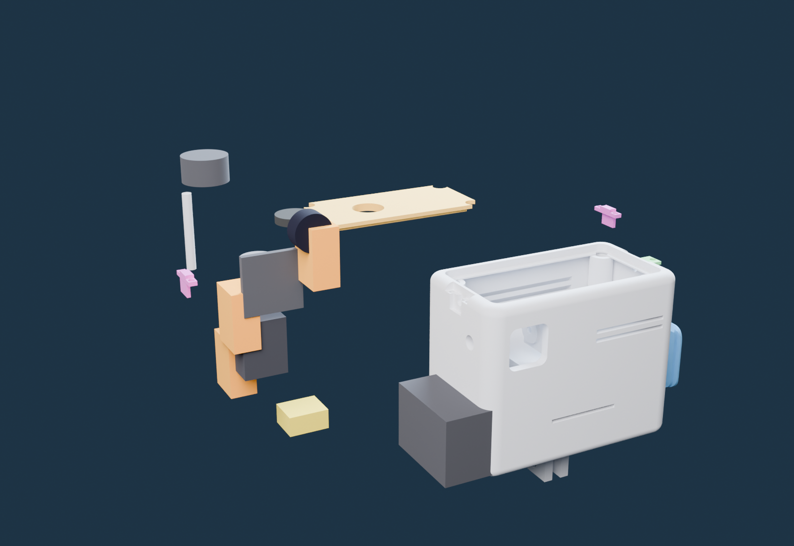

# Build a SkyLive sender — the whole thing on one page

*Every number below comes from the executed CAD or a caliper. Deep dives are linked at each step —
this page alone is enough to build one. **Wiring: soldered is the recommended flight build**
(cut every lead to its real run length — lighter, tighter, tougher); the Wago path below is the
zero-solder quick-build for your first assembly.*

## 1 · Buy (≈ €160 for the sender, EU prices 2026-07)

| # | part | ≈ € |
|---|---|---|
| 1 | HDZero Freestyle V2 VTX kit (incl. Nano90 camera + MIPI + JST-GH harness) | 90 |
| 2 | Tattu R-Line 3S 850 mAh XT30 (or 3S 300 HV for the Mini) | 12 |
| 3 | 12 mm latching push-button (850 only — the Mini has no switch by design) | 5 |
| 4 | 3× Wago 221-412 · XT30 female pigtail | 8 |
| 5 | RHCP 5.8 GHz omni (U.FL→SMA semi-rigid pigtail, Ø3.1 jacket) | 18 |
| 6 | Filament: PETG (fit prints) / ASA (final) — **never PLA** | 25/kg |
| 7 | Brass inserts: 3× M3 (Ø5×6) + 1× M2 (Ø3.2×3) | 3 |
| 8 | DIN 912 cap screws: 3× M3×8 · 8× M2×8 · 1× M2×6 · 2× M2 (camera) | 4 |
| 9 | 1.5 mm silicone thermal pad · 2 mm EVA foam · 50 Ω SMA dummy load | 14 |

Full alternatives table (other VTX/cameras/batteries with exact dimensions): [`BOM.md`](BOM.md)

## 2 · Print (4 files + 2 small parts twice)

`01_body` **lying on its back wall** (GoPro teeth horizontal = strong) · `02_lid`, `03_door`,
`04_latch ×2`, `05_T-piece ×2` flat. PETG 0.2 mm, 4 perimeters, 40 % gyroid, cooling ≤ 50 %,
paint-on supports only where marked. Full sheet: [`PRINT_DE.md`](PRINT_DE.md) (German) ·
dimensional drawing with scale: [`../docs/assets/blueprint.svg`](../docs/assets/blueprint.svg)

## 3 · Inserts first (empty shell, iron at 250–270 °C)

3× M3 into the roof posts from above · 1× M2 into the Ø2.8 bore above the battery opening
(horizontal, from outside — the door tab hides it). Sink 0.3 mm sub-flush. [Step 1 →](ASSEMBLY_STEPS.md)

## 4 · Antenna clamp (the screws ARE the clamp)

Drop the Ø3.1 coax **from above, all the way down** into the round Ø3.2 seat on either short
side — it goes in easily, the seat has clearance by design. The cable runs **horizontally
through the wall**, the omni sits right against it outside, axis through the wall. Slide the
T-piece down: its **R1.55 nose lands on the cable**, then **2× M2×8 (heads up) pull the nose
0.4 mm onto it — that's the clamp**. Nothing to drill or notch; both T-pieces identical, pick
either side. Finish with a firm pull test on the antenna. [Step 2 →](ASSEMBLY_STEPS.md)

## 5 · Electronics — solder it (recommended) or Wago it (quick)

*Where everything lives — [watch them fly in, animated](https://schoentom.github.io/skylive/viewer.html) (▶ Fly-in tab).*

VTX flat on its thermal pad against the wall · camera into its corner cradle (2× M2, the left one
comes through the outer wall) · battery leads into the saddle grooves, latch them (2× M2 each),
**then** plug XT30 · switch into the lid (850) · power joins: **solder + heat-shrink, leads trimmed to their true run** (recommended) — or 3× Wago 221-412 for the solder-free first build.
Wiring map + the three hardware killers (never power without antenna/dummy · multimeter polarity
check · U.FL seats once): [`BUILD_GUIDE.md`](BUILD_GUIDE.md)

## 6 · First power — on the bench

Dummy load on, 25 mW only, multimeter says +11–12.6 V on red. Picture on the goggles/monitor?
Then: foam pad in, battery in, door: slide → tip ≤ 4° → noses catch → 1× M2×6 into the brass
insert. Done. Full ritual + failure table: [Steps 8–10 →](ASSEMBLY_STEPS.md)

---

**Honesty ledger:** everything geometric here is gate-verified CAD; clamp holding force, insert
strength and RF tuning carry `MEASURE_ME` until the physical build log lands.
[What the gates caught →](WHAT_THE_GATES_CAUGHT.md)
